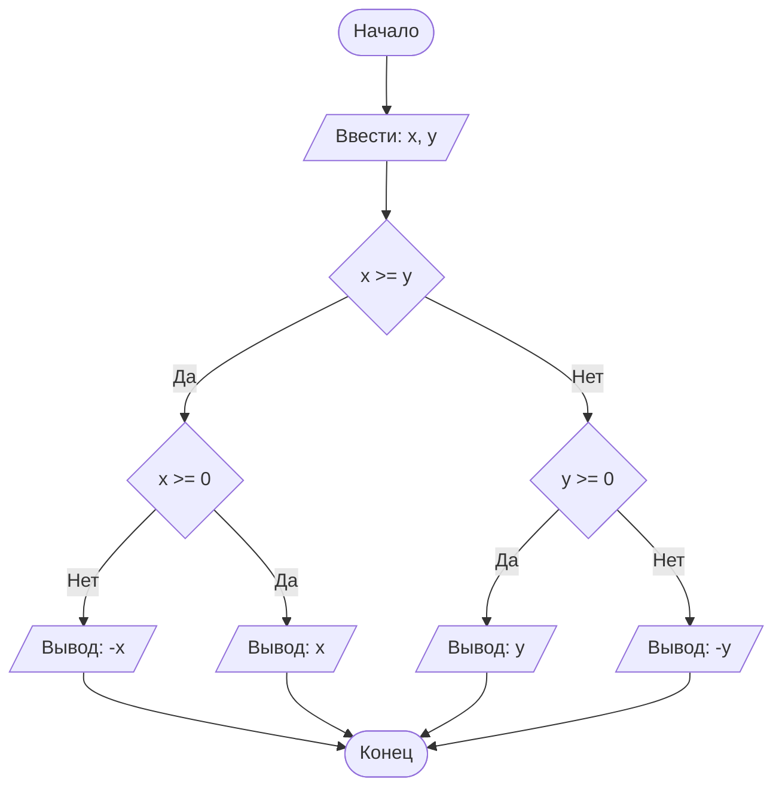

## Отчет по лабораторной работе № 1

#### № группы: `ПМ-2401`

#### Выполнил: `Радаев Андрей Денисович`

#### Вариант: `1`

### Cодержание:

- [Постановка задачи](#1-постановка-задачи)
- [Входные и выходные данные](#2-входные-и-выходные-данные)
- [Выбор структуры данных](#3-выбор-структуры-данных)
- [Алгоритм](#4-алгоритм)
- [Программа](#5-программа)
- [Анализ правильности решения](#6-анализ-правильности-решения)

### 1. Постановка задачи

> Программа получает на вход 2 числа a и 𝑏 и решает неравентсво (x - a) / (𝑏x) >= 0 относительно x.

Данную задачу можно решить с помощью условных операторов `if` `else`

Для решения задачи необходимо рассмотреть области определения неравентсва и решить само неравенство относительно x.

- Нахождение области определения:
  Для того чтобы неравнство было корректно определено, нужно учесть, что знаменатель не может быть равен нулю. То есть 𝑏𝑥 ≠ 0.
  Если 𝑏 = 0, то неравенство невозможно.

- Решение неравенства:
  Для удобства 

Данную задачу можно разделить на 2 подзадачи: нахождение максимального числа и получение модуля этого числа.

- Для 1 подзадачи нужно рассмотреть 2 случая:
    1. `X >= Y`
    2. `X < Y` (отрицание 1 случая)
- Пусть `Z = max(X, Y)`, тогда для 2 подзадачи нужно также рассмотреть 2 случая:
    1. `Z >= 0`
    2. `Z < 0` (отрицание 1 случая)

Всего надо рассмотреть `2 * 2 = 4` случая.

### 2. Входные и выходные данные

#### Данные на вход

На вход программа должна получать 2 числа, при этом в условии не сказано, к какому множеству
принадлежать получаемые числа, поэтому будем считать их вещественными. Также даны верхняя и нижняя границы получаемых
чисел.

|             | Тип                | min значение    | max значение   |
|-------------|--------------------|-----------------|----------------|
| X (Число 1) | Вещественное число | 10<sup>9</sup>  | 10<sup>9</sup> |
| Y (Число 2) | Вещественное число | -10<sup>9</sup> | 10<sup>9</sup> |

#### Данные на выход

Т.к. программа должна вывести модуль максимального из получаемых чисел, то на выход мы получим
единственное вещественное неотрицательное число, не превышающее 10<sup>9</sup>.

|         | Тип                                | min значение | max значение   |
|---------|------------------------------------|--------------|----------------|
| Число 1 | Вещественное неотрицательное число | 0            | 10<sup>9</sup> |

### 3. Выбор структуры данных

Программа получает 2 вещественных числа, не превышающих по модулю 10<sup>9</sup> < 2<sup>30</sup>. Поэтому для их хранения
можно выделить 2 переменных (`x` и `y`) типа `double`.

|             | название переменной | Тип (в Java) | 
|-------------|---------------------|--------------|
| X (Число 1) | `x`                 | `double`     |
| Y (Число 2) | `y`                 | `double`     | 

Для вывода результата необязательно его хранить в отдельной переменной.

### 4. Алгоритм

#### Алгоритм выполнения программы:

1. **Ввод данных:**  
   Программа считывает два вещественных числа, обозначенные как `x` и `y`.

2. **Сравнение чисел:**  
   Программа сравнивает значения `x` и `y`. Если `x` больше или равно `y`, программа переходит к следующему шагу для
   работы с `x`. Если `y` больше, программа выполняет действия для работы с `y`.

3. **Проверка знака для выбранного числа:**
    - Если было выбрано число `x` (так как оно больше или равно `y`), проверяется, положительное оно или отрицательное.
      Если `x` положительное, оно выводится на экран. Если отрицательное, выводится его модуль (т.е. противоположное
      по знаку значение).
    - Если было выбрано число `y` (поскольку оно больше `x`), выполняется аналогичная проверка. Если `y` положительное,
      оно выводится на экран. Если отрицательное, выводится его модуль.

4. **Вывод результата:**  
   На экран выводится либо большее из чисел, либо его модуль, если это число отрицательное.

#### Блок-схема



### 5. Программа

```java
import java.io.PrintStream;
import java.util.Scanner;

public class Main {
    // Объявляем объект класса Scanner для ввода данных
    public static Scanner in = new Scanner(System.in);
    // Объявляем объект класса PrintStream для вывода данных
    public static PrintStream out = System.out;

    public static void main(String[] args) {
        // Считывание двух вещественных чисел x и y из консоли
        double x = in.nextDouble();
        double y = in.nextDouble();

        // Определение максимального числа
        if (x >= y) {
            // Если x положительное, выводим x, иначе выводим -x,
            // чтобы на выходе было его абсолютное значение
            if (x >= 0) {
                out.println(x);
            } else {
                out.println(-x);
            }
        } else {
            // Если x положительное, выводим y, иначе выводим -y,
            // чтобы на выходе было его абсолютное значение
            if (y >= 0) {
                out.println(y);
            } else {
                out.println(-y);
            }
        }
    }
}
```

### 6. Анализ правильности решения

Программа работает корректно на всем множестве решений с учетом ограничений.

1. Тест на `X > Y > 0`:

    - **Input**:
        ```
        5 1.3
        ```

    - **Output**:
        ```
        5
        ```

2. Тест на `X < Y < 0`:

    - **Input**:
        ```
        -4 -2.2
        ```

    - **Output**:
        ```
        2.2
        ```

3. Тест на `X < 0 < Y`:

    - **Input**:
        ```
        -4 5
        ```

    - **Output**:
        ```
        5
        ```

4. Тест на `X = 0` или `Y = 0`:

    - **Input**:
        ```
        0 -3
        ```

    - **Output**:
        ```
        3
        ```

5. Тест на ограничение задачи:

    - **Input**:
        ```
        -1000000000 1000000000
        ```

    - **Output**:
        ```
        1000000000
        ```
